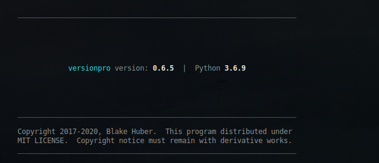

<a name="top"></a>
* * *
# Version Pro
* * *

## Summary

Python 3 utility for managing Python project version labels.  

    * Easily imported into any Code project
    * Conveniently called by build logic to update version prior to deployment

**Version**: 0.3.3

* * *

## Contents

* [**Dependencies**](#dependencies)

* [**Installation**](#installation)

* [**Use**](#use)

* [**Author & Copyright**](#author--copyright)

* [**License**](#license)

* [**Disclaimer**](#disclaimer)

--

[back to the top](#top)

* * *

## Dependencies

[versionpro](https://github.com/fstab50/versionpro) requires:

* [Python 3.6+](https://docs.python.org/3/).

* [Libtools](https://github.com/fstab50/libtools) General utilities library


[back to the top](#top)

* * *
## Installation

**versionpro** may be installed on Linux via [pip, python package installer](https://pypi.org/project/pip) in one of two methods:

To install **versionpro** for a single user:

```
$  pip3 install versionpro --user
```

To install **versionpro** for all users (Linux):

```
$  sudo -H pip3 install versionpro
```

[back to the top](#top)

* * *
## Use

**versionpro** automatically extracts the current project name from either DESCRIPTION.rst or MANIFEST.ln artifacts.


1. Increment project version:

    ```bash
    $ versionpro  --update
    ```

2. Hard Set project version::

    ```bash
    $ versionpro  --update --set-version 1.8.1
    ```

3. Utilise pypi version instead of project version:

    ```bash
    $ versionpro  --update --pypi
    ```

--

[back to the top](#top)

* * *

## Author & Copyright

All works contained herein copyrighted via below author unless work is explicitly noted by an alternate author.

* Copyright Blake Huber, All Rights Reserved.

[back to the top](#top)

* * *

## License

* Software contained in this repo is licensed under the [license agreement](./LICENSE.md).  You may display the license and copyright information by issuing the following command:

```
$ versionpro --version
```

<p align="center">
    <a href="http://images.awspros.world/versionpro/version-copyright.png" target="_blank">
</p>

[back to the top](#top)

* * *

## Disclaimer

*Code is provided "as is". No liability is assumed by either the code's originating author nor this repo's owner for their use at AWS or any other facility. Furthermore, running function code at AWS may incur monetary charges; in some cases, charges may be substantial. Charges are the sole responsibility of the account holder executing code obtained from this library.*

Additional terms may be found in the complete [license agreement](./LICENSE.md).

[back to the top](#top)

* * *
