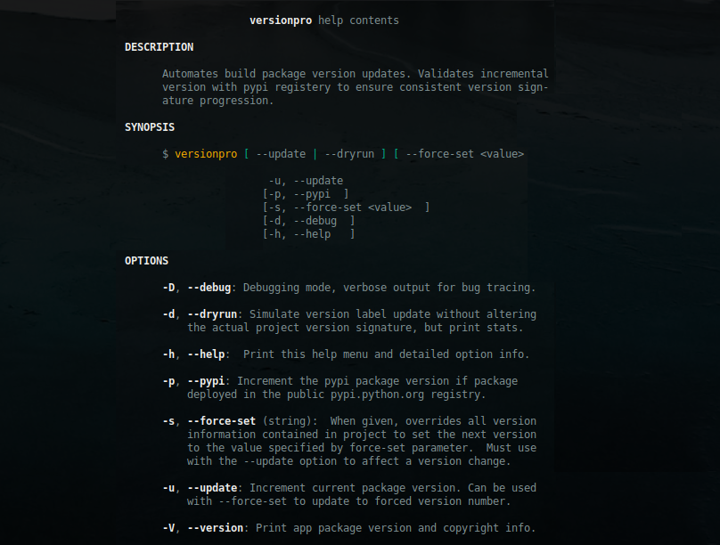

<a name="top"></a>
* * *
# Version Pro
* * *

## Summary

Python 3 build automation utility for managing Python project version labels

    * Easily imported into any Code project
    * Conveniently called by build logic to update version prior to deployment

**Version**: 0.6.5

* * *

## Contents

* [**Dependencies**](#dependencies)

* [**Installation**](#installation)

* [**Options**](#options)

* [**Use**](#use)

* [**Author & Copyright**](#author--copyright)

* [**License**](#license)

* [**Disclaimer**](#disclaimer)

--

[back to the top](#top)

* * *

## Dependencies

### I. Runtime Environment

* [Python 3.6+](https://docs.python.org/3/).
* [Libtools](https://github.com/fstab50/libtools) General utilities library

### II. Projects

Each Python project you for which you wish to automate versioning must:

* Store version number in a python module (file ending in '.py').  Module must contain `version` in the name.  Examples:
    * `_version.py`
    * `version.py`

* Have a `DESCRIPTION.rst` file.  File must contain a line `PACKAGE = <dir containing python modules>`. Example:

    ```
    $ cat DESCRIPTION.rst
    ```

    [](http://images.awspros.world/versionpro/description.rst.png)&nbsp;

--

[back to the top](#top)

* * *
## Installation

**versionpro** may be installed on Linux via [pip, python package installer](https://pypi.org/project/pip) in one of 3 slightly different ways:

1. Global install **versionpro** for a single user:

    ```
    $  pip3 install versionpro --user
    ```

2. Global install **versionpro** for all users (Linux):

    ```
    $  sudo -H pip3 install versionpro
    ```

3. Installation for only 1 project (virtual environment install):

    ```
    $ cd  <project root>
    $ . p3_venv/bin/activate     # virtual env = p3_venv
    $  pip install versionpro
    ```

Methods 1 and 2, one installation of **versionpro** will work for all local python 3 projects. For method 3, each python 3 project requires its own installation of **versionpro**.

[back to the top](#top)

* * *
## Options

```bash
$ versionpro --help
```

[](http://images.awspros.world/versionpro/help-menu.png)&nbsp;

--

[back to the top](#top)

* * *
## Use

**versionpro** automatically extracts the current project name from either DESCRIPTION.rst or MANIFEST.ln artifacts. Before issuing any of the following commands, cd to the project root directory (top level).


1. Increment project version:

    ```bash
    $ versionpro  --update
    ```

2. Hard Set project version::

    ```bash
    $ versionpro  --update --force-set 1.8.1
    ```

3. Utilise pypi version instead of project version:

    ```bash
    $ versionpro  --update --pypi
    ```

4. Dry (test only) run, no actual version update:

    ```bash
    $ versionpro  --dryrun
    ```

[](http://images.awspros.world/versionpro/dryrun.png)&nbsp;

--

[back to the top](#top)

* * *

## Author & Copyright

All works contained herein copyrighted via below author unless work is explicitly noted by an alternate author.

* Copyright Blake Huber, All Rights Reserved.

[back to the top](#top)

* * *

## License

* Software contained in this repo is licensed under the [license agreement](./LICENSE.md).  You may display the license and copyright information by issuing the following command:

```
$ versionpro --version
```

<p align="center">
    <a href="http://images.awspros.world/versionpro/version-copyright.png" target="_blank">
</p>

[back to the top](#top)

* * *

## Disclaimer

*Code is provided "as is". No liability is assumed by either the code's originating author nor this repo's owner for their use at AWS or any other facility. Furthermore, running function code at AWS may incur monetary charges; in some cases, charges may be substantial. Charges are the sole responsibility of the account holder executing code obtained from this library.*

Additional terms may be found in the complete [license agreement](./LICENSE.md).

[back to the top](#top)

* * *
